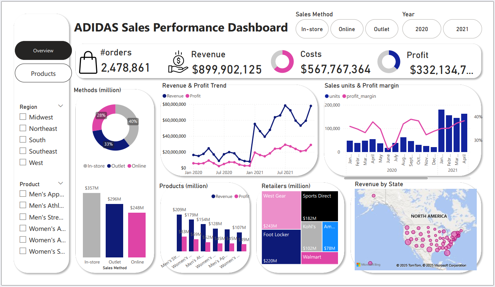
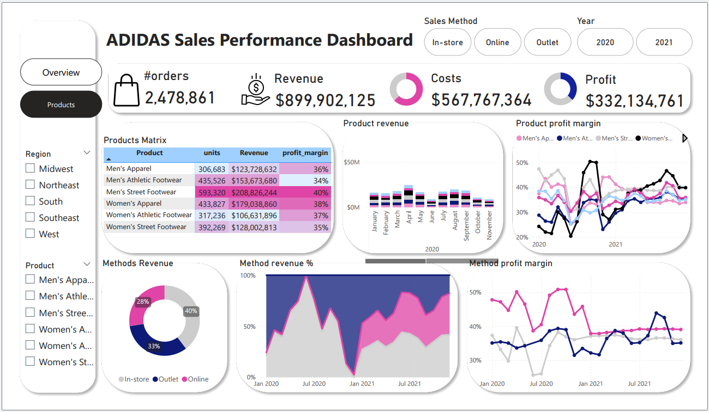

# Adidas US Sales Dashboard (Power BI)
This project is an interactive Power BI dashboard built to analyze Adidas US sales data.
It provides insights into regional sales performance, profit margins, and sales channels.
## 🎯 Project Objectives
- Analyze Adidas sales performance across US regions and product
- Identify trends in revenue, profit, and units sold
- Compare sales channels (in-store, outlet, online)
- Visualize KPIs such as total units sales, revenue, profit and cost.
## 📊 Key Dashboard Features
- **KPI Cards**: Total Units Sold, Revenue, Profit, and Cost  
- **Line Chart**: Monthly Revenue Trends  
- **Bar Charts**: Sales by Method and Product  
- **Map**: Revenue by U.S. States  
- **Matrix**: Product-level breakdown of Units Sold, Revenue, and Profit  
- **Tree Map**: Retailers by Total Revenue Contribution  
- **Slicers**: Dynamic filters by Region, Year, Sales Method, and Product  
- **Page Navigation**: Buttons for switching between report views
## 🖼️ Dashboard Screenshots

### 📌 Overview Page

### 🗺️ Product Page

